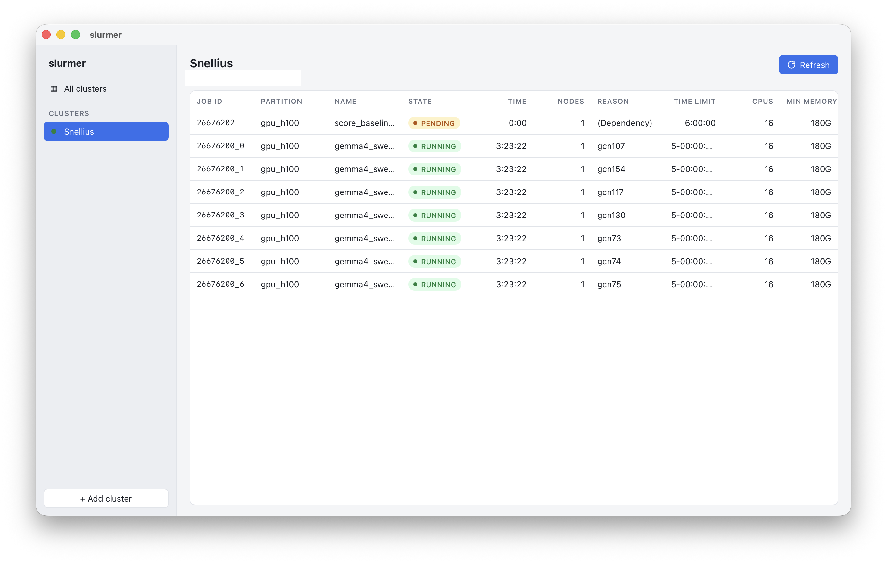

# slurmer

A small desktop app that shows your Slurm job queue on one or more HPC
clusters, fetched over ssh with a manual Refresh. Cross-platform port of
[Job Tracker](https://github.com/shawonashraf/jobtracker) built with Rust,
Tauri v2 and Svelte 5.



## How it works

- Saved cluster profiles (name, ssh host, user) live in `clusters.json` under
  the app's config directory.
- Refresh runs the system `ssh` binary:
  `ssh -o User=<user> <host> squeue --noheader -u '<user>' -o '<format>'`.
  The host is used verbatim, so aliases from `~/.ssh/config` apply, including
  `ControlMaster` sockets and any 2FA session you already opened in a terminal.
- When User is left blank, the app omits `-o User=` and runs `squeue --me`
  instead of `-u`, so the alias's own `User` line applies; `--me` needs
  Slurm 20.02 or newer.
- Output is parsed into a table with colour-coded job states.

If ssh needs an interactive login, open a terminal and run `ssh <host>` once,
then press Refresh again.

## Install

### macOS via Homebrew

```bash
brew install --cask shawonashraf/tap/slurmer
```

Release builds are ad-hoc signed and not notarized. The cask removes the
quarantine attribute from `slurmer.app` after installing, so the app opens
without the "damaged" Gatekeeper dialog and no manual `xattr` step is needed.
`brew upgrade` picks up new releases; the cask is regenerated automatically
when a release is published.

### Other platforms and manual installs

Download a bundle from the [releases page](https://github.com/shawonashraf/slurmer/releases):
`.dmg` for macOS, `.deb`/`.rpm`/`.AppImage` for Linux, `.msi`/`.exe` for
Windows. On macOS, clear the quarantine flag after copying the app to
`/Applications`:

```bash
xattr -cr /Applications/slurmer.app
```

## Requirements

- An `ssh` client on your PATH (built in on macOS, Linux, and Windows 10+).
- ssh access to a Slurm cluster.

## Develop

```bash
npm install
npm run tauri dev      # run the app with hot reload
npm run check          # svelte-check + tsc
cd src-tauri && cargo test && cargo clippy --all-targets
```

## Build

```bash
npm run tauri build    # bundles for the current platform into src-tauri/target/release/bundle/
```

Releases are cut by pushing a `v*` tag. The release workflow builds the
bundles as a draft release; publishing it triggers the `homebrew` workflow,
which regenerates the cask in
[shawonashraf/homebrew-tap](https://github.com/shawonashraf/homebrew-tap)
from `scripts/homebrew-cask.sh`.
